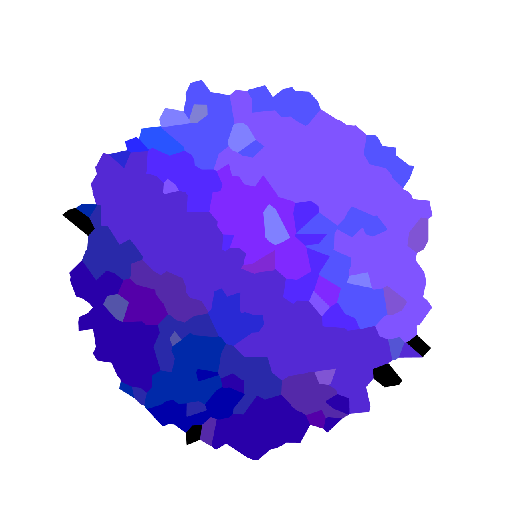
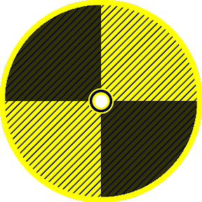

<h1>Description</h1>

Hi! Welcome to all Planet Client versions! This is used for users that are skeptical about downloading our service. Of course, this isn't a full proof plan but hopefully we can make online servers for people to use! You can also download the files from here instead of downloading them off our official website.

 
<h1>Contributors</h1>
<ol>
  
</ol>
 
<h1>Projects Linked to This Repository</h1>

  

  

